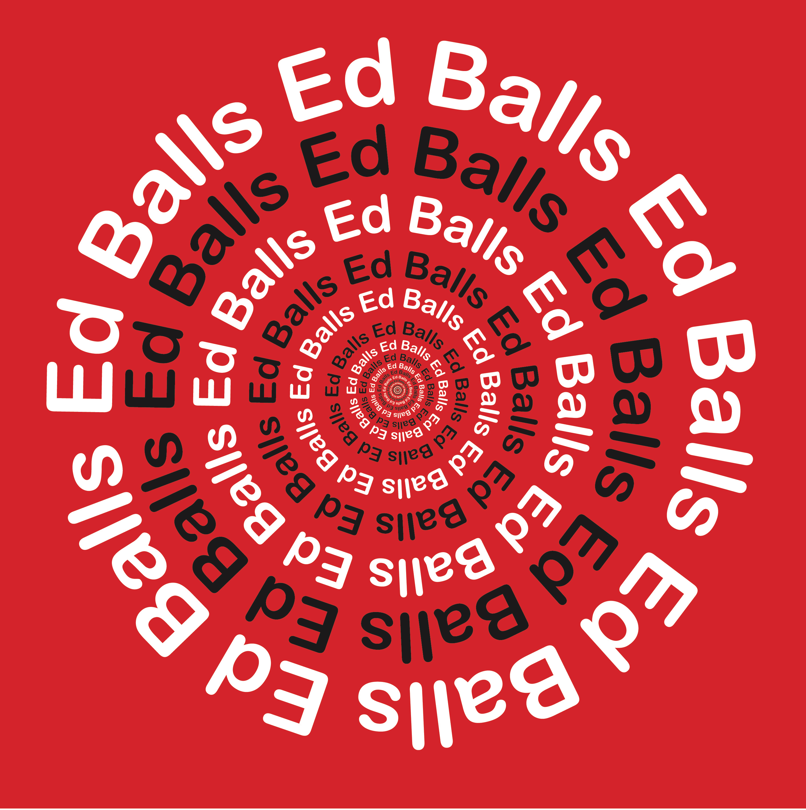

#ONE TWEET - SUMMATIVE PRESENTATION

One Tweet is a project about typography and creating meaning with text. We were told to create a poster choosing one of the following tweets:

* **[@jack](https://twitter.com/jack/status/20): just setting up my twttr**
* **[@CIA](https://twitter.com/CIA/status/474971393852182528): We can neither confirm nor deny that this is our first tweet.**
* **[@Snowden](https://twitter.com/Snowden/status/648890134243487744): Can you hear me now?**
* [@kourtneykardash](https://twitter.com/kourtneykardash/status/11175751424): Do ants have dicks?
* **[@usher](https://twitter.com/usher/status/654335781687984129): Justice or Just Us. Is the system broken?**
* **[@edballs](https://twitter.com/edballs/status/63623585020915713): Ed Balls**
* [@LeicesterPolice](https://twitter.com/CentralLeicsNPA/status/287937337781002240): Not a scam: If you’ve committed a burglary in the #Leicester area within the last week - come to our #police station & claim a FREE iPad.

The ones that are in bold are the ones that I chose. I'm going to start with the less successful ones and finish with the most successful following everyone's opinion in class and my own opinion.

###just setting up my twttr

I'm going to try to explain what message the poster is trying to give. When I saw this tweet the first thing that came to my mind was the idea of doing something that is related to the sign up page on twitter, basically when you first open a twitter account.  

I went to the twitter sign up page and I used the questions Twitter asks you when you are signing up. I put those questions in the poster and next to them as the answers I put the _tweet_. As I said, the idea was to give the sense of that someone was setting up their twitter account. As a background colour I used a gradient of the colours of the sign up page on twitter. I think this was the less successful one because the font wasn't the best choice, and the idea wasn't giving the message I wanted to give. It was a bit confusing for my classmates to get the idea of the poster and when it comes to make art you have to give a message straight away without having to explain what it mean too much.

###We can neither confirm nor deny that this is our first tweet.

This was the first poster I did when I started this project. I really like it because it's the first thing that I created on Illustrator. Back then, I had never used Illustrator before so this was the first challenge I had to meet when I started this project.  

The idea was to highlight the words "confirm" and "deny". To do that, I made them bigger than the other words and I changed their colours into ones that could be related to the meaning of the word itself. For example, green for "confirm" and red for "deny". I didn't want to leave it just like that so I decided to play with shapes what I can put within those two words. I thought of shapes that, again, are related to the meaning of the words "confirm" and  "deny". For the word "confirm" I used a _tick_ and for the word "deny" I used an _X_. With those two elements within the words "confirm" and "deny" I was trying to highlight those two words more and make a good poster. Something that I don't like of the poster and the class agreed with me in this point is that, there isn't a good organisation of the sentences and the words. You can clearly see the two main words but the sentences are not really in the right spot and therefore the poster looks a bit unorganised.

###Ed Balls

This is probably the simplest tweet from the list. I think this was a good challenge to do because I wanted to see what I could come up with about this simple tweet. The first thing that came to my mind was playing with the word "Balls" because I thought it was the only word I could do something with in terms of shapes or colours. "Ed" it's just a name so I didn't have many ideas for that.

I made the word "Balls" literally a ball unlike the word "Ed", which is just a simple word with no effects on it. I wanted to keep the poster simple as the tweet is simple as well. The reason I chose those colours are because I wanted give the sense of football. This was just following my personal opinion, when I think of the word "ball" one of the first things that come to my mind is the famous sport football. So I tried to make the poster related to football. I made the background colour green as the usual football pitch and I made the colour of the text black and white as the usual colours of a classic football.

I realised that I should make the poster a bit more related to the tweet and doing some research I found out that the guy who tweeted "Ed Balls" was a politician so I thought of applying colours that are related to politics to the poster but always keeping in mind that I was trying to do a simple poster. With that being said, I did my research into political colours and I found out that a lot of colours are used in politics to represent a certain idea. I also went to Ed's official website and I saw red in text and in boxes that you could find in the website. In that moment I thought of using the colour red as the background colour of my poster and that's what I did.

###Ed Balls second variation

This is a second variation of the same tweet. In this case I wanted to make the whole tweet a ball. But I didn't want to stop there, I wanted to go further, so I did a sort of a looping circle saying "Ed Balls". I used red as the background colour as well and something I didn't say before, I also used red because in [politics terms](https://en.wikipedia.org/wiki/Political_colour) it means communism.

I really like this poster because it's the only poster that actually gives an effect on me, it makes me dizzy every time I look at it and if I keep looking that dizzy feeling won't go away. I think giving a feeling using an image is a good start. Everyone in class seemed to like the poster as well because of the looping effect so that's why I'm going to select it as my third favourite poster in this project.

###Justice or Just Us. Is the system broken?

Here we go with my second favourite poster. I really like this poster because I managed to do a _broken_ word effect in the word "Broken". As I said I used Illustrator for first time just to do this project so this was such a fun experience learning how to do this kind of effects.

I also make the word "just" bold so we can highlight the repetition within the tweet. I love that effect as well and I kept it a simple poster just using colour white for the text and black colour for the background. I really liked this poster and it helped me to improve my Illustrator skills. I got good reactions from everyone in class so that makes me happy about it as well.

###Can you hear me now?

To conclue, I'm going to show you my favourite poster... are you ready? yeah? okay let's countdown.

Yeah, that's my favourite poster. Why? Simply because it is such a simple poster where I just play with the opacity and size of the text. I tried to give a feeling of that someone was saying "Can you hear me now" but at the same time that person was saying that, the sound of the sentence was getting away from the person who was listening to it, or the person who was listening to it was getting away from the person who said it. It could be interpreted as you wish. My personal interpretation would be someone getting away from me as they say "Can you hear me now?".

I really love this poster because it didn't take me much long to think of an idea for this tweet. All the rest o tweets took me longer than this one and this one was probably the most successful one. I love the idea of trying to create "sound" in an image just by playing with the size, the opacity and the order of placement of the words.

I used blue as the background colour because I wanted the image to be kind of related with the sky. The text being the clouds and the blue representing the sky obviously. Also because when I think that giving the sense of the heaven would make more sense when it comes to try to represent sound in an image. It would probably make more sense than using red as the background colour and black for the text, those are really strong colours and probably would give a different feeling if I would've used them.

###To conclue

This was such a great experience. I got to improve my Illustrator skills, I got to learn a bit more about colours and typography and I really enjoyed creating all these posters, from the less successful one until the most successful one.
